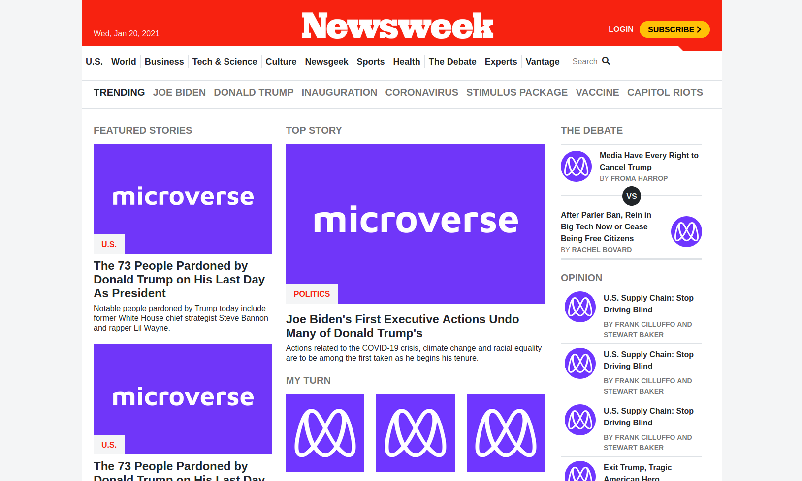

# Newsweek Copycat with Bootstrap

> Microverse's project #3 of the first module: HTML & CSS3. The goal is to create a look-alike Newsweek website using HTML, CSS and Bootstrap.
> The goal is to have a page that looks like .

## Built With

- HTML
- CSS
- Bootstrap

## Live Demo

[Live Demo Link](https://fernandorpm.github.io/mv-project3/)

## Getting Started

Be sure to have a github account and that this account is connected locally on your PC

### Setup

Create a new folder/directory for the project

### Install

- open your terminal on your OS
- go to the desired folder/directory that you want to have the project in
- git clone https://github.com/fernandorpm/mv-project3.git

## Authors

👤 **Jose Alberto Arriaga Ramos**

- GitHub: [@jaarkira](https://github.com/jaarkira )
- Twitter: [@91_jaar](https://twitter.com/91_jaar )
- LinkedIn: [Jose Arriaga](https://www.linkedin.com/in/jose-arriaga-63a851204/)

👤 **Fernando R P Marques**

- GitHub: [@fernandorpm](https://github.com/fernandorpm)
- Twitter: [@rpm_fernando](https://twitter.com/rpm_fernando)
- LinkedIn: [Fernando R P Marques](https://linkedin.com/fernandorpm)

## 🤝 Contributing

Contributions, issues, and feature requests are welcome!

Feel free to check the [issues page](issues/).

## Show your support

Give a ⭐️ if you like this project!

## Acknowledgments

- Hat tip to anyone whose code was used
- Inspiration
- etc

## 📝 License

This project is [MIT](lic.url) licensed.
